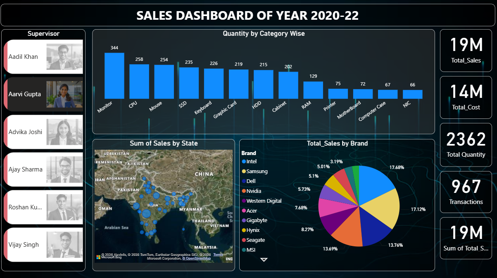

# 📊 Sales Analytics Dashboard

An interactive Power BI dashboard designed to analyze sales performance, customer behavior, and business growth trends. This project transforms raw sales data into actionable insights through dynamic visualizations and KPIs.

## 🚀 Project Overview

The dashboard helps businesses monitor key sales metrics and make data-driven decisions by providing:

- Sales performance analysis
- Revenue tracking
- Customer insights
- Regional sales comparison
- Product category analysis
- Interactive filtering and drill-down capabilities

## 📌 Key Features

### 📈 Sales KPIs
- Total Sales
- Total Profit
- Total Orders
- Average Sales Value
- Performance Indicators

### 🌍 Regional Analysis
- Sales by Region
- Geographic Sales Distribution
- Regional Performance Comparison

### 🛍 Product Analysis
- Sales by Category
- Product-wise Performance
- Contribution Analysis

### 🎯 Interactive Dashboard
- Region Slicer
- Category Slicer
- Year Filter
- Segment Filter
- Dynamic Visual Updates

## 🛠 Tools & Technologies

- **Power BI**
- **Data Modeling**
- **Data Visualization**
- **DAX Measures**
- **Business Intelligence**

## 📊 Dashboard Visuals

The dashboard includes:

- KPI Cards
- Clustered Column Charts
- Pie Charts
- Geographic Map Visualization
- Interactive Slicers

## 📂 Repository Structure

```
Sales-Analytics-Dashboard/
│
├── Sales_dashboard.pbix
├── Dataset.xlsx
├── Dashboard_Screenshot.png
└── README.md
```

## 🎯 Business Insights Generated

- Identify top-performing regions
- Track sales trends over time
- Analyze customer segments
- Monitor category-wise performance
- Support strategic business decisions

## 📷 Dashboard Preview

Add your dashboard screenshot here:



## 🔗 Author

**Yash Gondkar**
